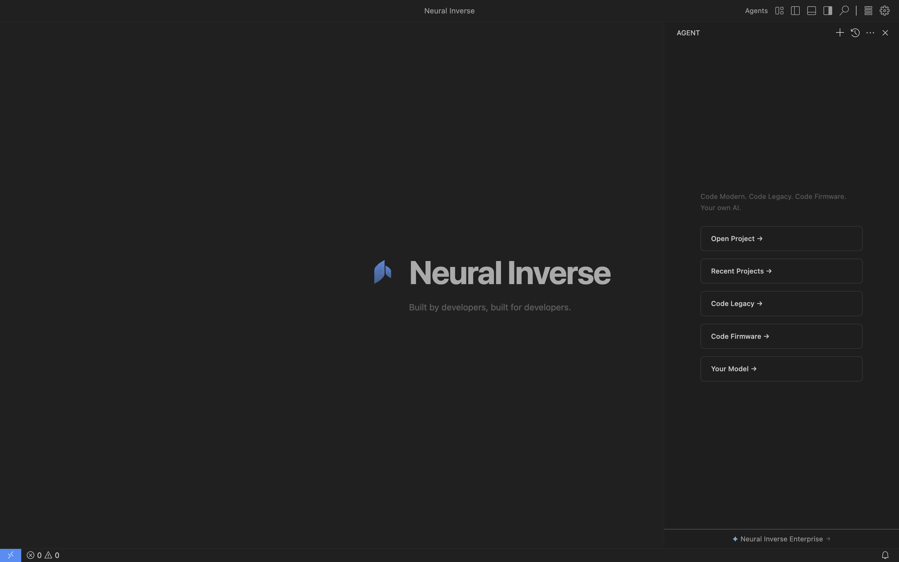

# Neural Inverse - Open Source ("Neural Inverse OSS")

[](https://github.com/NeuralInverse/neuralinverse/issues?q=is%3Aissue+is%3Aopen+label%3Aenhancement)
[](https://github.com/NeuralInverse/neuralinverse/issues?q=is%3Aissue+is%3Aopen+label%3Abug)
[](https://github.com/sponsors/NeuralInverse)

## The Repository

This repository ("Neural Inverse OSS") is where we (Neural Inverse) develop the Neural Inverse open-source edition together with the community. Not only do we work on code and issues here, but we also publish our [roadmap](https://github.com/orgs/NeuralInverse/projects) and iteration plans. This source code is available to everyone under the [Apache License 2.0](./License.txt).

## NeuralInverse

<div align="center">
	
</div>

[NeuralInverse](https://neuralinverse.com) is an AI-native IDE built for the work most AI tools ignore — modernizing legacy systems, developing firmware, and migrating regulated codebases. It is a distribution of the Neural Inverse OSS repository with additional features released under a commercial license.

NeuralInverse combines the editing experience of VS Code with purpose-built tooling for embedded engineers, enterprise architects, and teams maintaining safety-critical or regulated software. It is an open-source Cursor alternative with AI chat, inline edit, autocomplete, and an autonomous coding agent — plus specialized modules for firmware and legacy migration that no other AI IDE offers. Bring your own LLM — 20 providers supported, API keys never leave your machine.

NeuralInverse is updated regularly with new features and bug fixes. You can download it for Windows, macOS, and Linux on [NeuralInverse's website](https://neuralinverse.com).

**Install:**

```bash
# macOS / Linux
curl -fsSL https://neuralinverse.com/sh | bash

# Windows (PowerShell)
irm https://neuralinverse.com/win | iex
```

## Features

- **AI Chat & Inline Edit** (Ctrl+L, Ctrl+K) — multi-mode sidebar chat, inline diffs, autocomplete, Fast Apply
- **Power Mode** (Cmd+Alt+P) — autonomous coding agent with 22+ tools and concurrent sub-agents
- **Bring Your Own LLM** — 20 providers (cloud, local, gateway), per-feature model selection, zero lock-in
- **Firmware & Embedded** (Cmd+Alt+F) — 357 MCU variants, SVD register maps, 22 `fw_*` agent tools, serial monitor, MISRA/CERT-C compliance
- **Legacy Modernisation** (Cmd+Alt+M) — 5-stage migration pipeline, 30+ source languages, 61 translation profiles, Knowledge Base, audit export
- **Agent Manager** (Cmd+Alt+A) — model management, deployments, agent orchestration

## Contributing

There are many ways in which you can participate in this project, for example:

- [Submit bugs and feature requests](https://github.com/NeuralInverse/neuralinverse/issues), and help us verify as they are checked in
- [Review source code changes](https://github.com/NeuralInverse/neuralinverse/pulls)
- Add new LLM provider integrations
- Add new language support to the modernisation engine
- Add new MCU/platform support to the firmware module

If you are interested in fixing issues and contributing directly to the code base, please see the document [How to Contribute](./HOW_TO_CONTRIBUTE.md), which covers:

- How to [build and run from source](./HOW_TO_CONTRIBUTE.md)
- The development workflow, including debugging and running tests
- [Coding guidelines](./CONTRIBUTING.md)
- Submitting pull requests

Full contributor guides are available at [neuralinverse.com/guides/contributing](https://neuralinverse.com/guides/contributing):

- [Getting Started](https://neuralinverse.com/guides/contributing/getting-started) — dev setup and first contribution
- [Architecture](https://neuralinverse.com/guides/contributing/architecture) — module map, DI, how features connect
- [Bring Your Own LLM](https://neuralinverse.com/guides/contributing/byollm) — providers, per-feature model selection, adding providers
- [AI Chat & Inline Edit](https://neuralinverse.com/guides/contributing/ai-chat) — sidebar chat, Ctrl+K, autocomplete, Fast Apply
- [Power Mode](https://neuralinverse.com/guides/contributing/power-mode) — autonomous agent, tools, sub-agents, configuration
- [Firmware & Embedded](https://neuralinverse.com/guides/contributing/firmware) — MCU database, SVD, serial monitor, agent tools
- [Legacy Modernisation](https://neuralinverse.com/guides/contributing/modernisation) — 5-stage pipeline, adding languages and profiles
- [Model Management](https://neuralinverse.com/guides/contributing/model-management) — deployment registry, cloud provisioning, agent manager UI

## Feedback

- [Request a new feature](https://github.com/NeuralInverse/neuralinverse/issues/new?template=feature_request.md)
- [File an issue](https://github.com/NeuralInverse/neuralinverse/issues/new?template=bug_report.md)
- Email: github@neuralinverse.com
- Website: [neuralinverse.com](https://neuralinverse.com)

## Related Projects

| Module | Path | What it does |
|--------|------|--------------|
| AI Chat & Core | `src/vs/workbench/contrib/void/` | Sidebar chat, inline edit, autocomplete, LLM routing, settings |
| Power Mode | `src/vs/workbench/contrib/powerMode/` | Autonomous agent with tool calling |
| Agent Manager | `src/vs/workbench/contrib/neuralInverse/` | Model management, deployments, agent orchestration |
| Firmware | `src/vs/workbench/contrib/neuralInverseFirmware/` | MCU database, SVD register maps, serial monitor, fw_* tools |
| Modernisation | `src/vs/workbench/contrib/neuralInverseModernisation/` | 5-stage legacy migration engine |

## Development Container

This repository includes a [Visual Studio Code Dev Containers](https://aka.ms/vscode-remote/download/containers) / [GitHub Codespaces](https://github.com/features/codespaces) development container.

- For **Dev Containers**, use the **Dev Containers: Clone Repository in Container Volume...** command which creates a Docker volume for better disk I/O on macOS and Windows.
- For **Codespaces**, install the [GitHub Codespaces](https://marketplace.visualstudio.com/items?itemName=GitHub.codespaces) extension in VS Code and use the **Codespaces: Create New Codespace** command.

Docker / the Codespace should have at least 4 cores and 6 GB of RAM (8 GB recommended) to run a full build.

## Building from Source

```bash
npm install
npm run watch          # Terminal 1: watch TypeScript
npm run watchreact     # Terminal 2: watch React UI
./scripts/code.sh      # Terminal 3: launch dev instance (macOS/Linux)
.\scripts\code.bat     # Terminal 3: launch dev instance (Windows)
```

See [HOW_TO_CONTRIBUTE.md](./HOW_TO_CONTRIBUTE.md) for full platform-specific setup instructions.

## License

Copyright (c) Neural Inverse Inc. All rights reserved.

Licensed under the [Apache License 2.0](./License.txt).

Neural Inverse OSS is built on [VS Code](https://github.com/microsoft/vscode) by Microsoft, licensed under MIT.
